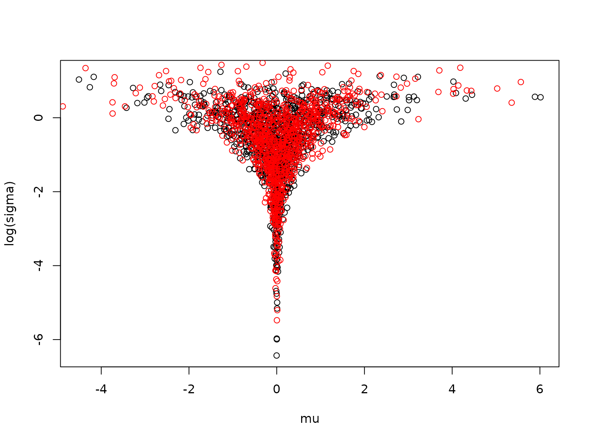
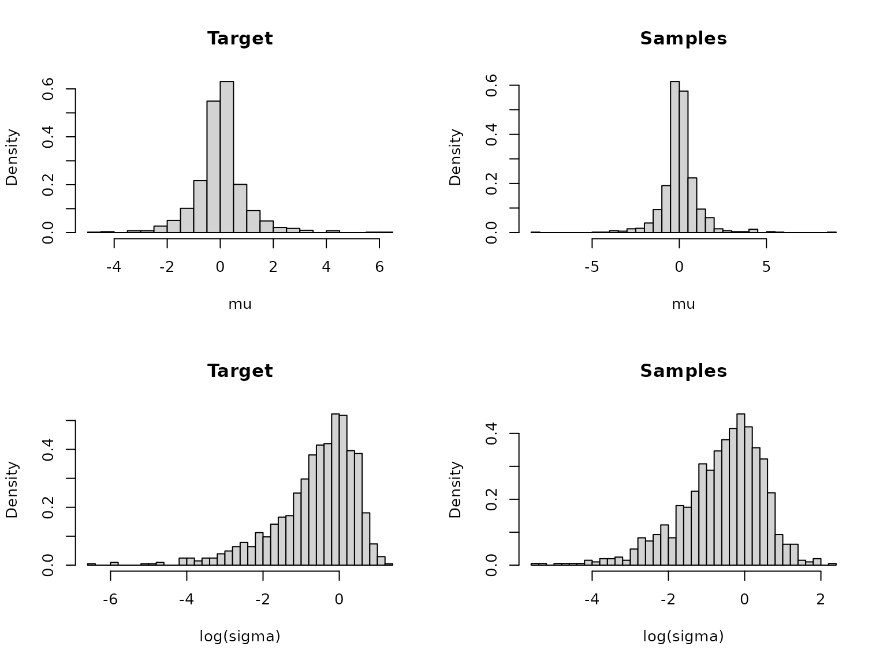
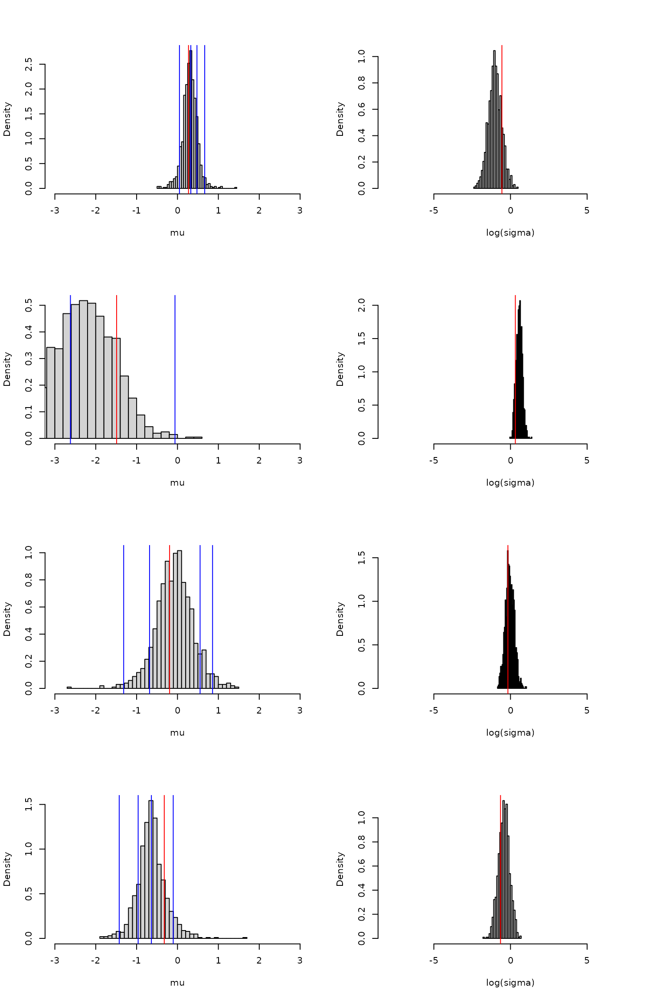
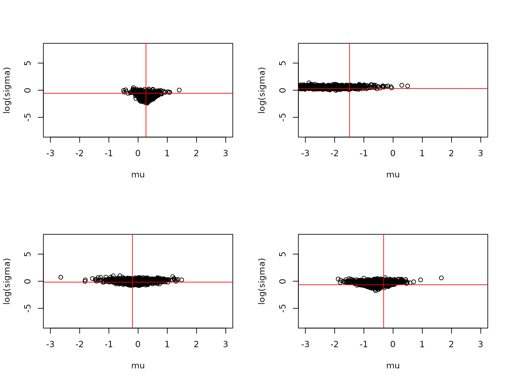
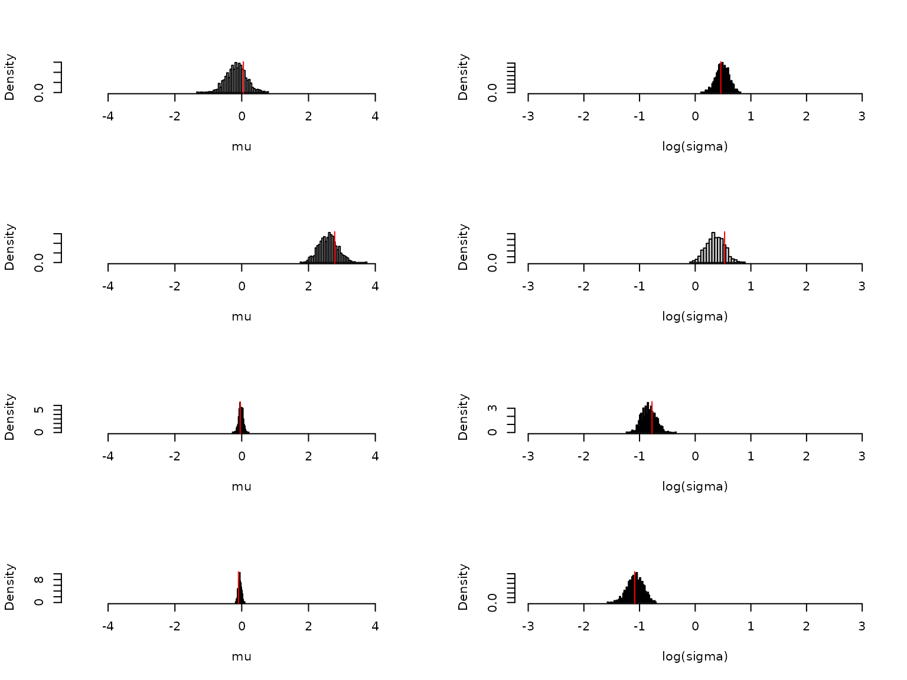
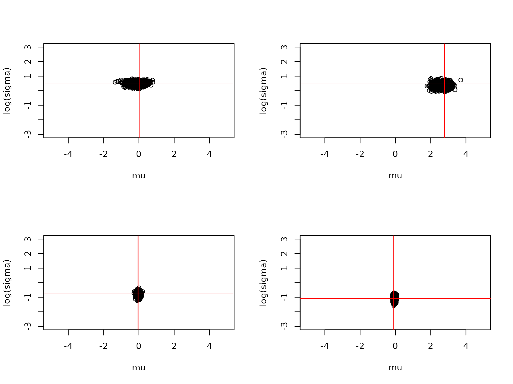
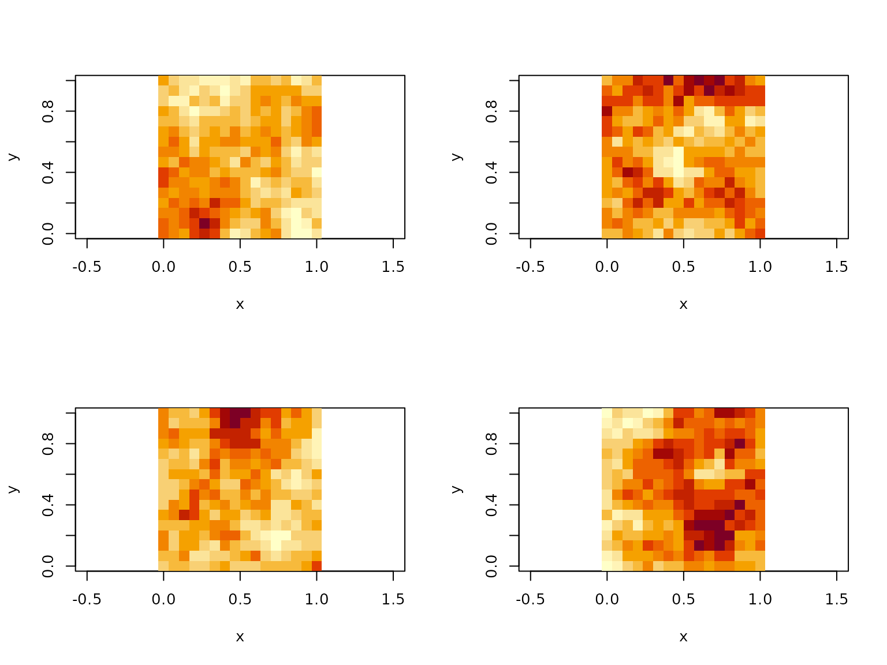
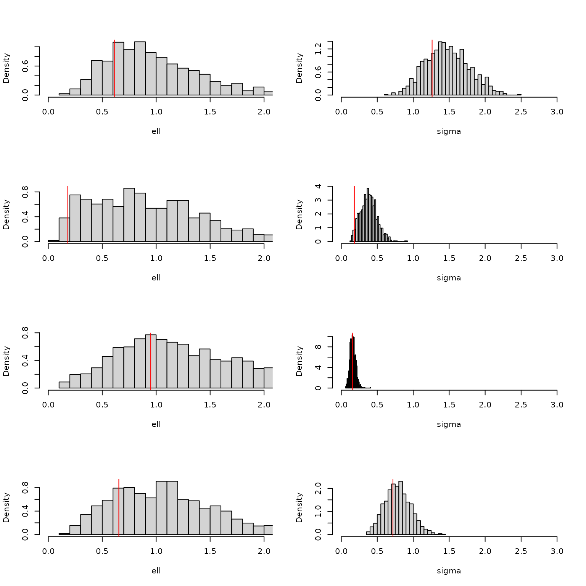
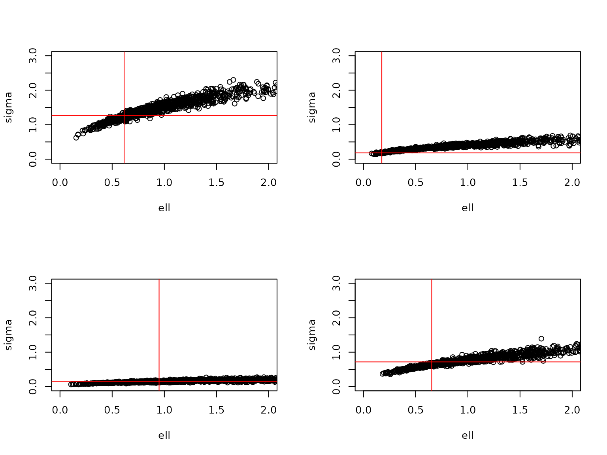

# torchflow

``` r

library(torch)
library(torchflow)
```

## Introduction

*This vignette is still under construction*

**Give mathematical details of normalizing flows**

## Creating and sampling from a flow

A simple two parameter normalising flow can be created as follows:

``` r

flow_model <- nn_sequential_conditional_flow(
  nn_affine_coupling_block(2),
  nn_permutation_flow(2),
  nn_affine_coupling_block(2),
  nn_permutation_flow(2),
  nn_affine_coupling_block(2)
)
```

This flow has five layers, which alternate between affine coupling
blocks and permutation flows. The flow is just a standard torch
`nn_module` and can be used in the usual way:

``` r

x <- torch_randn(5, 2)
flow_model(x)
#> torch_tensor
#>  1.7179  0.6873
#>  0.2569  1.2622
#>  0.2112  0.5482
#>  0.6333  0.8801
#>  1.2444  0.3795
#> [ CPUFloatType{5,2} ][ grad_fn = <CatBackward0> ]
```

The first dimension of the input acts as a batch dimension, so the flow
can be used to generate multiple samples at once. The above code
actually implements sampling from the distribution represented by the
flow. This can also be done directly using the
`generate_from_conditional_flow` function:

``` r

generate_from_conditional_flow(flow_model, 5)
#> torch_tensor
#>  0.1701  1.2481
#> -0.8484  0.4220
#> -0.1483  0.0610
#>  1.2175 -1.3286
#>  0.2228 -0.0904
#> [ CPUFloatType{5,2} ][ grad_fn = <ViewBackward0> ]
```

## Spline coupling flows

Coupling blocks can also use rational-quadratic spline transforms.
ActNorm blocks can be inserted as standalone layers:

``` r

spline_flow_model <- nn_sequential_conditional_flow(
  nn_actnorm_block(2),
  nn_spline_coupling_block(2, bins = 8),
  nn_permutation_flow(2),
  nn_actnorm_block(2),
  nn_spline_coupling_block(2, bins = 8)
)

x <- torch_randn(5, 2)
y <- spline_flow_model(x)
x_recovered <- spline_flow_model$reverse(y)

y
#> torch_tensor
#>  0.0647  0.1708
#> -0.7780  0.0936
#>  1.2688  1.0145
#> -1.3678  0.5485
#> -0.7063  1.2729
#> [ CPUFloatType{5,2} ][ grad_fn = <CatBackward0> ]
torch_max(torch_abs(x - x_recovered))
#> torch_tensor
#> 3.725290298461914e-08
#> [ CPUFloatType{} ][ grad_fn = <MaxBackward1> ]
```

## Univariate flows

The same interface can be used for a univariate target by setting
`input_size = 1`. Spline coupling blocks use a single coupling
internally, and can be composed to build richer univariate flows.

``` r

flow_model <- nn_sequential_conditional_flow(
  nn_spline_coupling_block(1),
  nn_spline_coupling_block(1)
)

x <- torch_randn(5, 1)
y <- flow_model(x)
x_recovered <- flow_model$reverse(y)

y
#> torch_tensor
#>  2.2168
#>  0.2091
#> -1.1785
#> -0.8041
#>  1.4215
#> [ CPUFloatType{5,1} ][ grad_fn = <CatBackward0> ]
torch_max(torch_abs(x - x_recovered))
#> torch_tensor
#> 0
#> [ CPUFloatType{} ][ grad_fn = <MaxBackward1> ]
```

Sampling works in the same way as for multivariate flows:

``` r

generate_from_conditional_flow(flow_model, 5)
#> torch_tensor
#>  1.6415
#>  1.7105
#> -1.7468
#>  1.4666
#> -1.2473
#> [ CPUFloatType{5,1} ][ grad_fn = <ViewBackward0> ]
```

## Conditional flow

A conditional flow takes an additional input, the conditioning variable,
which can be used to condition the samples on some additional
information. The flow therefore encodes a conditional distribution. The
following code creates a conditional flow with the same architecture as
the unconditional flow defined above but with an additional conditioning
variable of dimension 3:

``` r

flow_model <- nn_sequential_conditional_flow(
  nn_affine_coupling_block(2, 3),
  nn_permutation_flow(2),
  nn_affine_coupling_block(2, 3),
  nn_permutation_flow(2),
  nn_affine_coupling_block(2, 3)
)
```

We can sample from the flow for a given conditioning variable as
follows:

``` r

conditioning <- torch_randn(3)
generate_from_conditional_flow(flow_model, 5, conditioning)
#> torch_tensor
#>  1.3427 -1.0032
#> -1.5097  0.6648
#> -1.0214  0.1426
#>  0.7233  0.3910
#> -1.2330  0.6616
#> [ CPUFloatType{5,2} ][ grad_fn = <ViewBackward0> ]
```

We can also do this for a batch of conditioning variables:

``` r

conditioning <- torch_randn(8, 3)
generate_from_conditional_flow(flow_model, 5, conditioning)
#> torch_tensor
#> (1,.,.) = 
#>  0.0416  0.4903
#>   0.6840  0.5995
#>   1.7326  1.0740
#>  -0.8492  0.6209
#>   0.8082  2.1107
#>   0.6547 -0.8297
#>   1.5801 -0.5704
#>   0.7626 -0.3476
#> 
#> (2,.,.) = 
#> -0.4957  0.3075
#>   0.8407  1.2028
#>  -0.6546  0.0608
#>  -0.5537  0.5423
#>  -1.2205  0.0433
#>   1.4881 -0.8850
#>  -1.3780  1.2798
#>  -0.9202  0.8891
#> 
#> (3,.,.) = 
#> -0.0358 -0.3371
#>   0.5324 -0.2289
#>  -0.7385  1.3433
#>  -0.9971 -0.4866
#>  -2.8624 -1.3913
#>  -0.0631 -0.5767
#>  -1.0078 -0.5679
#>   0.4528 -0.4577
#> 
#> ... [the output was truncated (use n=-1 to disable)]
#> [ CPUFloatType{5,8,2} ][ grad_fn = <ViewBackward0> ]
```

## Training an unconditional flow

The above flows are randomly initialised, so samples from them do not
follow any interesting distribution. We can instead train a flow to
follow a given distribution using samples from that distribution.

Let us train a flow to match the following distribution
$`\sigma \sim N^+(0, 1)`$, $`\mu \sim N(0, \sigma^2)`$, where
$`N^+(0, 1)`$ is the half normal distribution with mean 0 and standard
deviation 1. We can generate samples from this distribution as follows.
Note that we take the logarithm of the $`\sigma`$ parameter to ensure
that it has real support; the flow targets this transformed
distribution.

``` r

generate_samples <- function(...) {
  n_samples <- 1024
  sigma <- torch_abs(torch_randn(n_samples))
  mu <- torch_randn(n_samples) * sigma
  list(target = torch_stack(list(mu, torch_log(sigma)), 2))
}

generate_samples()
#> $target
#> torch_tensor
#>  1.4078 -0.1516
#>  0.1619 -0.9840
#>  0.3720 -1.4109
#> -1.8222 -0.6166
#>  0.3198  0.2025
#>  0.1260 -0.9170
#>  0.1048 -2.2995
#> -0.0068 -2.3473
#>  5.1051  0.8975
#>  0.3631 -0.1862
#> -0.0392 -3.3018
#> -1.2448  0.0778
#>  0.0603 -1.5085
#>  0.4443  0.7738
#>  0.2539 -1.1918
#> -0.1806 -0.8638
#>  0.2013  0.7066
#> -0.2705  0.4622
#>  0.2554 -1.8927
#>  0.6628  0.0809
#>  1.5557  0.0725
#> -4.4410  0.8451
#> -0.6911 -0.0879
#> -0.0794  0.5344
#>  1.7295  0.6690
#>  0.3014 -0.1149
#>  0.1736 -2.3976
#>  0.7211  0.3601
#> -0.2952 -0.4846
#>  1.6849  0.4495
#> ... [the output was truncated (use n=-1 to disable)]
#> [ CPUFloatType{1024,2} ]
```

This function can be used to train the flow to match the distribution
using the `train_conditional_flow` function:

``` r

# Make an unconditional flow
flow_model <- nn_sequential_conditional_flow(
  nn_affine_coupling_block(2),
  nn_permutation_flow(2),
  nn_affine_coupling_block(2),
  nn_permutation_flow(2),
  nn_affine_coupling_block(2)
)

# Generate a test set
test_set <- generate_samples()

# Train the flow
train_conditional_flow(
  flow_model,
  generate_samples,
  n_epochs = 128,
  batch_size = 1024,
  after_epoch = function(...) {
    test_loss <- as_array(forward_kl_loss(flow_model(test_set$target)))
    cat('Test loss:', test_loss, '\n')
  }
)
#> = Starting epoch 1 
#> Test loss: 1.192193 
#> = Starting epoch 2 
#> Test loss: 1.133625 
#> = Starting epoch 3 
#> Test loss: 1.067848 
#> = Starting epoch 4 
#> Test loss: 0.9964097 
#> = Starting epoch 5 
#> Test loss: 0.9247698 
#> = Starting epoch 6 
#> Test loss: 0.8548194 
#> = Starting epoch 7 
#> Test loss: 0.7895316 
#> = Starting epoch 8 
#> Test loss: 0.7276387 
#> = Starting epoch 9 
#> Test loss: 0.6680658 
#> = Starting epoch 10 
#> Test loss: 0.6062267 
#> = Starting epoch 11 
#> Test loss: 0.5470526 
#> = Starting epoch 12 
#> Test loss: 0.4965625 
#> = Starting epoch 13 
#> Test loss: 0.4758255 
#> = Starting epoch 14 
#> Test loss: 0.4514318 
#> = Starting epoch 15 
#> Test loss: 0.4618566 
#> = Starting epoch 16 
#> Test loss: 0.4451246 
#> = Starting epoch 17 
#> Test loss: 0.473314 
#> = Starting epoch 18 
#> Test loss: 0.4446838 
#> = Starting epoch 19 
#> Test loss: 0.4357255 
#> = Starting epoch 20 
#> Test loss: 0.4339485 
#> = Starting epoch 21 
#> Test loss: 0.4161826 
#> = Starting epoch 22 
#> Test loss: 0.4045274 
#> = Starting epoch 23 
#> Test loss: 0.4142436 
#> = Starting epoch 24 
#> Test loss: 0.4095464 
#> = Starting epoch 25 
#> Test loss: 0.3917949 
#> = Starting epoch 26 
#> Test loss: 0.3865648 
#> = Starting epoch 27 
#> Test loss: 0.3890164 
#> = Starting epoch 28 
#> Test loss: 0.3886444 
#> = Starting epoch 29 
#> Test loss: 0.3883346 
#> = Starting epoch 30 
#> Test loss: 0.3869959 
#> = Starting epoch 31 
#> Test loss: 0.3795865 
#> = Starting epoch 32 
#> Test loss: 0.3725685 
#> = Starting epoch 33 
#> Test loss: 0.3722701 
#> = Starting epoch 34 
#> Test loss: 0.3730264 
#> = Starting epoch 35 
#> Test loss: 0.3735918 
#> = Starting epoch 36 
#> Test loss: 0.3660091 
#> = Starting epoch 37 
#> Test loss: 0.3588941 
#> = Starting epoch 38 
#> Test loss: 0.3600026 
#> = Starting epoch 39 
#> Test loss: 0.3560542 
#> = Starting epoch 40 
#> Test loss: 0.3564112 
#> = Starting epoch 41 
#> Test loss: 0.357451 
#> = Starting epoch 42 
#> Test loss: 0.3517385 
#> = Starting epoch 43 
#> Test loss: 0.3541207 
#> = Starting epoch 44 
#> Test loss: 0.3547005 
#> = Starting epoch 45 
#> Test loss: 0.3518279 
#> = Starting epoch 46 
#> Test loss: 0.3534946 
#> = Starting epoch 47 
#> Test loss: 0.3611968 
#> = Starting epoch 48 
#> Test loss: 0.3524582 
#> = Starting epoch 49 
#> Test loss: 0.3505865 
#> = Starting epoch 50 
#> Test loss: 0.3492982 
#> = Starting epoch 51 
#> Test loss: 0.3490276 
#> = Starting epoch 52 
#> Test loss: 0.3600411 
#> = Starting epoch 53 
#> Test loss: 0.3476688 
#> = Starting epoch 54 
#> Test loss: 0.3508847 
#> = Starting epoch 55 
#> Test loss: 0.3480189 
#> = Starting epoch 56 
#> Test loss: 0.3538189 
#> = Starting epoch 57 
#> Test loss: 0.3564135 
#> = Starting epoch 58 
#> Test loss: 0.3498394 
#> = Starting epoch 59 
#> Test loss: 0.346329 
#> = Starting epoch 60 
#> Test loss: 0.3477117 
#> = Starting epoch 61 
#> Test loss: 0.3440098 
#> = Starting epoch 62 
#> Test loss: 0.3457586 
#> = Starting epoch 63 
#> Test loss: 0.3395473 
#> = Starting epoch 64 
#> Test loss: 0.3406793 
#> = Starting epoch 65 
#> Test loss: 0.3439919 
#> = Starting epoch 66 
#> Test loss: 0.342172 
#> = Starting epoch 67 
#> Test loss: 0.349689 
#> = Starting epoch 68 
#> Test loss: 0.3430805 
#> = Starting epoch 69 
#> Test loss: 0.3389173 
#> = Starting epoch 70 
#> Test loss: 0.3392885 
#> = Starting epoch 71 
#> Test loss: 0.3423255 
#> = Starting epoch 72 
#> Test loss: 0.3428674 
#> = Starting epoch 73 
#> Test loss: 0.3387966 
#> = Starting epoch 74 
#> Test loss: 0.3424947 
#> = Starting epoch 75 
#> Test loss: 0.3457115 
#> = Starting epoch 76 
#> Test loss: 0.3447536 
#> = Starting epoch 77 
#> Test loss: 0.3437839 
#> = Starting epoch 78 
#> Test loss: 0.338828 
#> = Starting epoch 79 
#> Test loss: 0.3346277 
#> = Starting epoch 80 
#> Test loss: 0.3334674 
#> = Starting epoch 81 
#> Test loss: 0.3340393 
#> = Starting epoch 82 
#> Test loss: 0.3336533 
#> = Starting epoch 83 
#> Test loss: 0.3341531 
#> = Starting epoch 84 
#> Test loss: 0.3322111 
#> = Starting epoch 85 
#> Test loss: 0.3347909 
#> = Starting epoch 86 
#> Test loss: 0.3347741 
#> = Starting epoch 87 
#> Test loss: 0.3308733 
#> = Starting epoch 88 
#> Test loss: 0.3310525 
#> = Starting epoch 89 
#> Test loss: 0.3307816 
#> = Starting epoch 90 
#> Test loss: 0.3316883 
#> = Starting epoch 91 
#> Test loss: 0.3304616 
#> = Starting epoch 92 
#> Test loss: 0.3306396 
#> = Starting epoch 93 
#> Test loss: 0.3399062 
#> = Starting epoch 94 
#> Test loss: 0.3306135 
#> = Starting epoch 95 
#> Test loss: 0.3302236 
#> = Starting epoch 96 
#> Test loss: 0.337094 
#> = Starting epoch 97 
#> Test loss: 0.3270627 
#> = Starting epoch 98 
#> Test loss: 0.3389605 
#> = Starting epoch 99 
#> Test loss: 0.3387972 
#> = Starting epoch 100 
#> Test loss: 0.3335708 
#> = Starting epoch 101 
#> Test loss: 0.3472291 
#> = Starting epoch 102 
#> Test loss: 0.3365577 
#> = Starting epoch 103 
#> Test loss: 0.3321988 
#> = Starting epoch 104 
#> Test loss: 0.3483598 
#> = Starting epoch 105 
#> Test loss: 0.3467729 
#> = Starting epoch 106 
#> Test loss: 0.3272054 
#> = Starting epoch 107 
#> Test loss: 0.3348717 
#> = Starting epoch 108 
#> Test loss: 0.3403797 
#> = Starting epoch 109 
#> Test loss: 0.3284846 
#> = Starting epoch 110 
#> Test loss: 0.3415016 
#> = Starting epoch 111 
#> Test loss: 0.335772 
#> = Starting epoch 112 
#> Test loss: 0.328819 
#> = Starting epoch 113 
#> Test loss: 0.3314244 
#> = Starting epoch 114 
#> Test loss: 0.3284698 
#> = Starting epoch 115 
#> Test loss: 0.3321001 
#> = Starting epoch 116 
#> Test loss: 0.3349137 
#> = Starting epoch 117 
#> Test loss: 0.3323621 
#> = Starting epoch 118 
#> Test loss: 0.3318624 
#> = Starting epoch 119 
#> Test loss: 0.329792 
#> = Starting epoch 120 
#> Test loss: 0.3289927 
#> = Starting epoch 121 
#> Test loss: 0.3270006 
#> = Starting epoch 122 
#> Test loss: 0.324139 
#> = Starting epoch 123 
#> Test loss: 0.3239949 
#> = Starting epoch 124 
#> Test loss: 0.3238574 
#> = Starting epoch 125 
#> Test loss: 0.3228601 
#> = Starting epoch 126 
#> Test loss: 0.3230047 
#> = Starting epoch 127 
#> Test loss: 0.3240964 
#> = Starting epoch 128 
#> Test loss: 0.3245459
```

It looks as though the test loss has converged. We can sample from the
trained flow as follows and compare the samples to the test set:

``` r

test_samples <- as_array(generate_from_conditional_flow(flow_model, 1024))
test_target <- as_array(test_set$target)
plot(test_target, xlab = 'mu', ylab = 'log(sigma)')
points(test_samples, col = 'red')
```



This looks like a reasonable approximation to the target distribution.
We can also look at marginal histograms:

``` r

par(mfrow = c(2, 2))
hist(test_target[, 1], main = 'Target', xlab = 'mu', freq = FALSE, breaks = 32)
hist(test_samples[, 1], main = 'Samples', xlab = 'mu', freq = FALSE, breaks = 32)
hist(test_target[, 2], main = 'Target', xlab = 'log(sigma)', freq = FALSE, breaks = 32)
hist(test_samples[, 2], main = 'Samples', xlab = 'log(sigma)', freq = FALSE, breaks = 32)
```



These look okay.

## Training a conditional flow

The process for training a conditional flow is the same as for an
unconditional flow, except that the `generate` function now also returns
the conditioning variable. Let’s add a conditioning variable,
$`y \sim N(\mu, \sigma^2)`$, with four replicates:

``` r

generate_conditional_samples <- function(...) {
  n_samples <- 1024
  sigma <- torch_abs(torch_randn(n_samples))
  mu <- torch_randn(n_samples) * sigma
  y <- torch_unsqueeze(mu, 2) + torch_randn(n_samples, 4) * torch_unsqueeze(sigma, 2)
  list(
    target = torch_stack(list(mu, torch_log(sigma)), 2),
    conditioning = y
  )
}

# Make a conditional flow
flow_model <- nn_sequential_conditional_flow(
  nn_affine_coupling_block(2, 4),
  nn_permutation_flow(2),
  nn_affine_coupling_block(2, 4),
  nn_permutation_flow(2),
  nn_affine_coupling_block(2, 4)
)

# Generate a test set
test_set <- generate_conditional_samples()
str(test_set)
#> List of 2
#>  $ target      :Float [1:1024, 1:2]
#>  $ conditioning:Float [1:1024, 1:4]

# Train the flow
train_conditional_flow(
  flow_model,
  generate_conditional_samples,
  n_epochs = 256,
  batch_size = 1024,
  after_epoch = function(...) {
    test_loss <- as_array(forward_kl_loss(flow_model(test_set$target, test_set$conditioning)))
    cat('Test loss:', test_loss, '\n')
  }
)
#> = Starting epoch 1 
#> Test loss: 1.182373 
#> = Starting epoch 2 
#> Test loss: 1.112105 
#> = Starting epoch 3 
#> Test loss: 1.038888 
#> = Starting epoch 4 
#> Test loss: 0.9641711 
#> = Starting epoch 5 
#> Test loss: 0.8888053 
#> = Starting epoch 6 
#> Test loss: 0.8131318 
#> = Starting epoch 7 
#> Test loss: 0.7370822 
#> = Starting epoch 8 
#> Test loss: 0.6594728 
#> = Starting epoch 9 
#> Test loss: 0.5794646 
#> = Starting epoch 10 
#> Test loss: 0.4959565 
#> = Starting epoch 11 
#> Test loss: 0.407536 
#> = Starting epoch 12 
#> Test loss: 0.3160904 
#> = Starting epoch 13 
#> Test loss: 0.2255729 
#> = Starting epoch 14 
#> Test loss: 0.137872 
#> = Starting epoch 15 
#> Test loss: 0.05966717 
#> = Starting epoch 16 
#> Test loss: 0.004103839 
#> = Starting epoch 17 
#> Test loss: -0.03029847 
#> = Starting epoch 18 
#> Test loss: -0.04691112 
#> = Starting epoch 19 
#> Test loss: -0.05551678 
#> = Starting epoch 20 
#> Test loss: -0.08245492 
#> = Starting epoch 21 
#> Test loss: -0.1307901 
#> = Starting epoch 22 
#> Test loss: -0.1898184 
#> = Starting epoch 23 
#> Test loss: -0.2518724 
#> = Starting epoch 24 
#> Test loss: -0.2835209 
#> = Starting epoch 25 
#> Test loss: -0.3330079 
#> = Starting epoch 26 
#> Test loss: -0.383348 
#> = Starting epoch 27 
#> Test loss: -0.440035 
#> = Starting epoch 28 
#> Test loss: -0.4653577 
#> = Starting epoch 29 
#> Test loss: -0.5053006 
#> = Starting epoch 30 
#> Test loss: -0.5436277 
#> = Starting epoch 31 
#> Test loss: -0.576721 
#> = Starting epoch 32 
#> Test loss: -0.5997151 
#> = Starting epoch 33 
#> Test loss: -0.602532 
#> = Starting epoch 34 
#> Test loss: -0.6110654 
#> = Starting epoch 35 
#> Test loss: -0.6603447 
#> = Starting epoch 36 
#> Test loss: -0.6911004 
#> = Starting epoch 37 
#> Test loss: -0.7216598 
#> = Starting epoch 38 
#> Test loss: -0.7502022 
#> = Starting epoch 39 
#> Test loss: -0.7615544 
#> = Starting epoch 40 
#> Test loss: -0.787514 
#> = Starting epoch 41 
#> Test loss: -0.8193688 
#> = Starting epoch 42 
#> Test loss: -0.8488042 
#> = Starting epoch 43 
#> Test loss: -0.8726512 
#> = Starting epoch 44 
#> Test loss: -0.8916656 
#> = Starting epoch 45 
#> Test loss: -0.8988534 
#> = Starting epoch 46 
#> Test loss: -0.9078624 
#> = Starting epoch 47 
#> Test loss: -0.9300594 
#> = Starting epoch 48 
#> Test loss: -0.9404053 
#> = Starting epoch 49 
#> Test loss: -0.9750069 
#> = Starting epoch 50 
#> Test loss: -0.9960424 
#> = Starting epoch 51 
#> Test loss: -0.9605005 
#> = Starting epoch 52 
#> Test loss: -0.9987951 
#> = Starting epoch 53 
#> Test loss: -1.033989 
#> = Starting epoch 54 
#> Test loss: -0.9994045 
#> = Starting epoch 55 
#> Test loss: -1.073301 
#> = Starting epoch 56 
#> Test loss: -1.078676 
#> = Starting epoch 57 
#> Test loss: -1.070393 
#> = Starting epoch 58 
#> Test loss: -1.093874 
#> = Starting epoch 59 
#> Test loss: -1.056556 
#> = Starting epoch 60 
#> Test loss: -1.051744 
#> = Starting epoch 61 
#> Test loss: -1.101452 
#> = Starting epoch 62 
#> Test loss: -1.108722 
#> = Starting epoch 63 
#> Test loss: -1.111386 
#> = Starting epoch 64 
#> Test loss: -1.14598 
#> = Starting epoch 65 
#> Test loss: -1.164662 
#> = Starting epoch 66 
#> Test loss: -1.153785 
#> = Starting epoch 67 
#> Test loss: -1.163095 
#> = Starting epoch 68 
#> Test loss: -1.169363 
#> = Starting epoch 69 
#> Test loss: -1.163785 
#> = Starting epoch 70 
#> Test loss: -1.17055 
#> = Starting epoch 71 
#> Test loss: -1.194137 
#> = Starting epoch 72 
#> Test loss: -1.193874 
#> = Starting epoch 73 
#> Test loss: -1.174616 
#> = Starting epoch 74 
#> Test loss: -1.206589 
#> = Starting epoch 75 
#> Test loss: -1.211468 
#> = Starting epoch 76 
#> Test loss: -1.207958 
#> = Starting epoch 77 
#> Test loss: -1.225413 
#> = Starting epoch 78 
#> Test loss: -1.233982 
#> = Starting epoch 79 
#> Test loss: -1.243667 
#> = Starting epoch 80 
#> Test loss: -1.263218 
#> = Starting epoch 81 
#> Test loss: -1.267154 
#> = Starting epoch 82 
#> Test loss: -1.26754 
#> = Starting epoch 83 
#> Test loss: -1.268281 
#> = Starting epoch 84 
#> Test loss: -1.260491 
#> = Starting epoch 85 
#> Test loss: -1.265645 
#> = Starting epoch 86 
#> Test loss: -1.271238 
#> = Starting epoch 87 
#> Test loss: -1.277655 
#> = Starting epoch 88 
#> Test loss: -1.286033 
#> = Starting epoch 89 
#> Test loss: -1.282942 
#> = Starting epoch 90 
#> Test loss: -1.29478 
#> = Starting epoch 91 
#> Test loss: -1.291468 
#> = Starting epoch 92 
#> Test loss: -1.300102 
#> = Starting epoch 93 
#> Test loss: -1.290621 
#> = Starting epoch 94 
#> Test loss: -1.300214 
#> = Starting epoch 95 
#> Test loss: -1.293672 
#> = Starting epoch 96 
#> Test loss: -1.305208 
#> = Starting epoch 97 
#> Test loss: -1.304945 
#> = Starting epoch 98 
#> Test loss: -1.321242 
#> = Starting epoch 99 
#> Test loss: -1.314343 
#> = Starting epoch 100 
#> Test loss: -1.326037 
#> = Starting epoch 101 
#> Test loss: -1.319565 
#> = Starting epoch 102 
#> Test loss: -1.323908 
#> = Starting epoch 103 
#> Test loss: -1.334535 
#> = Starting epoch 104 
#> Test loss: -1.322221 
#> = Starting epoch 105 
#> Test loss: -1.321765 
#> = Starting epoch 106 
#> Test loss: -1.33423 
#> = Starting epoch 107 
#> Test loss: -1.332948 
#> = Starting epoch 108 
#> Test loss: -1.339203 
#> = Starting epoch 109 
#> Test loss: -1.335896 
#> = Starting epoch 110 
#> Test loss: -1.341194 
#> = Starting epoch 111 
#> Test loss: -1.346449 
#> = Starting epoch 112 
#> Test loss: -1.358631 
#> = Starting epoch 113 
#> Test loss: -1.350926 
#> = Starting epoch 114 
#> Test loss: -1.346662 
#> = Starting epoch 115 
#> Test loss: -1.355905 
#> = Starting epoch 116 
#> Test loss: -1.348621 
#> = Starting epoch 117 
#> Test loss: -1.349571 
#> = Starting epoch 118 
#> Test loss: -1.357604 
#> = Starting epoch 119 
#> Test loss: -1.343068 
#> = Starting epoch 120 
#> Test loss: -1.344723 
#> = Starting epoch 121 
#> Test loss: -1.350523 
#> = Starting epoch 122 
#> Test loss: -1.367468 
#> = Starting epoch 123 
#> Test loss: -1.372964 
#> = Starting epoch 124 
#> Test loss: -1.373043 
#> = Starting epoch 125 
#> Test loss: -1.370417 
#> = Starting epoch 126 
#> Test loss: -1.375646 
#> = Starting epoch 127 
#> Test loss: -1.374753 
#> = Starting epoch 128 
#> Test loss: -1.381429 
#> = Starting epoch 129 
#> Test loss: -1.378006 
#> = Starting epoch 130 
#> Test loss: -1.379149 
#> = Starting epoch 131 
#> Test loss: -1.378031 
#> = Starting epoch 132 
#> Test loss: -1.373506 
#> = Starting epoch 133 
#> Test loss: -1.373495 
#> = Starting epoch 134 
#> Test loss: -1.39555 
#> = Starting epoch 135 
#> Test loss: -1.362576 
#> = Starting epoch 136 
#> Test loss: -1.391833 
#> = Starting epoch 137 
#> Test loss: -1.377768 
#> = Starting epoch 138 
#> Test loss: -1.387993 
#> = Starting epoch 139 
#> Test loss: -1.378717 
#> = Starting epoch 140 
#> Test loss: -1.377146 
#> = Starting epoch 141 
#> Test loss: -1.383498 
#> = Starting epoch 142 
#> Test loss: -1.400559 
#> = Starting epoch 143 
#> Test loss: -1.386252 
#> = Starting epoch 144 
#> Test loss: -1.368818 
#> = Starting epoch 145 
#> Test loss: -1.399115 
#> = Starting epoch 146 
#> Test loss: -1.394872 
#> = Starting epoch 147 
#> Test loss: -1.386927 
#> = Starting epoch 148 
#> Test loss: -1.39661 
#> = Starting epoch 149 
#> Test loss: -1.40307 
#> = Starting epoch 150 
#> Test loss: -1.392983 
#> = Starting epoch 151 
#> Test loss: -1.408146 
#> = Starting epoch 152 
#> Test loss: -1.39025 
#> = Starting epoch 153 
#> Test loss: -1.402869 
#> = Starting epoch 154 
#> Test loss: -1.388273 
#> = Starting epoch 155 
#> Test loss: -1.398575 
#> = Starting epoch 156 
#> Test loss: -1.401421 
#> = Starting epoch 157 
#> Test loss: -1.407255 
#> = Starting epoch 158 
#> Test loss: -1.392082 
#> = Starting epoch 159 
#> Test loss: -1.396863 
#> = Starting epoch 160 
#> Test loss: -1.410049 
#> = Starting epoch 161 
#> Test loss: -1.405115 
#> = Starting epoch 162 
#> Test loss: -1.411435 
#> = Starting epoch 163 
#> Test loss: -1.415449 
#> = Starting epoch 164 
#> Test loss: -1.398754 
#> = Starting epoch 165 
#> Test loss: -1.397963 
#> = Starting epoch 166 
#> Test loss: -1.358517 
#> = Starting epoch 167 
#> Test loss: -1.385158 
#> = Starting epoch 168 
#> Test loss: -1.359846 
#> = Starting epoch 169 
#> Test loss: -1.29613 
#> = Starting epoch 170 
#> Test loss: -1.402402 
#> = Starting epoch 171 
#> Test loss: -1.344185 
#> = Starting epoch 172 
#> Test loss: -1.347904 
#> = Starting epoch 173 
#> Test loss: -1.397904 
#> = Starting epoch 174 
#> Test loss: -1.389089 
#> = Starting epoch 175 
#> Test loss: -1.322032 
#> = Starting epoch 176 
#> Test loss: -1.385696 
#> = Starting epoch 177 
#> Test loss: -1.379668 
#> = Starting epoch 178 
#> Test loss: -1.373662 
#> = Starting epoch 179 
#> Test loss: -1.392098 
#> = Starting epoch 180 
#> Test loss: -1.418043 
#> = Starting epoch 181 
#> Test loss: -1.38066 
#> = Starting epoch 182 
#> Test loss: -1.385327 
#> = Starting epoch 183 
#> Test loss: -1.377574 
#> = Starting epoch 184 
#> Test loss: -1.29486 
#> = Starting epoch 185 
#> Test loss: -1.30119 
#> = Starting epoch 186 
#> Test loss: -1.357249 
#> = Starting epoch 187 
#> Test loss: -1.405124 
#> = Starting epoch 188 
#> Test loss: -1.388363 
#> = Starting epoch 189 
#> Test loss: -1.366155 
#> = Starting epoch 190 
#> Test loss: -1.399587 
#> = Starting epoch 191 
#> Test loss: -1.413017 
#> = Starting epoch 192 
#> Test loss: -1.382978 
#> = Starting epoch 193 
#> Test loss: -1.373667 
#> = Starting epoch 194 
#> Test loss: -1.398624 
#> = Starting epoch 195 
#> Test loss: -1.421038 
#> = Starting epoch 196 
#> Test loss: -1.396904 
#> = Starting epoch 197 
#> Test loss: -1.402232 
#> = Starting epoch 198 
#> Test loss: -1.425868 
#> = Starting epoch 199 
#> Test loss: -1.415671 
#> = Starting epoch 200 
#> Test loss: -1.40134 
#> = Starting epoch 201 
#> Test loss: -1.40226 
#> = Starting epoch 202 
#> Test loss: -1.422513 
#> = Starting epoch 203 
#> Test loss: -1.418728 
#> = Starting epoch 204 
#> Test loss: -1.395606 
#> = Starting epoch 205 
#> Test loss: -1.417021 
#> = Starting epoch 206 
#> Test loss: -1.403119 
#> = Starting epoch 207 
#> Test loss: -1.383206 
#> = Starting epoch 208 
#> Test loss: -1.404176 
#> = Starting epoch 209 
#> Test loss: -1.414542 
#> = Starting epoch 210 
#> Test loss: -1.396154 
#> = Starting epoch 211 
#> Test loss: -1.379712 
#> = Starting epoch 212 
#> Test loss: -1.417914 
#> = Starting epoch 213 
#> Test loss: -1.419961 
#> = Starting epoch 214 
#> Test loss: -1.390139 
#> = Starting epoch 215 
#> Test loss: -1.375754 
#> = Starting epoch 216 
#> Test loss: -1.391989 
#> = Starting epoch 217 
#> Test loss: -1.418898 
#> = Starting epoch 218 
#> Test loss: -1.415817 
#> = Starting epoch 219 
#> Test loss: -1.385042 
#> = Starting epoch 220 
#> Test loss: -1.415354 
#> = Starting epoch 221 
#> Test loss: -1.427649 
#> = Starting epoch 222 
#> Test loss: -1.414428 
#> = Starting epoch 223 
#> Test loss: -1.407155 
#> = Starting epoch 224 
#> Test loss: -1.41301 
#> = Starting epoch 225 
#> Test loss: -1.418762 
#> = Starting epoch 226 
#> Test loss: -1.41833 
#> = Starting epoch 227 
#> Test loss: -1.408263 
#> = Starting epoch 228 
#> Test loss: -1.429723 
#> = Starting epoch 229 
#> Test loss: -1.429499 
#> = Starting epoch 230 
#> Test loss: -1.41951 
#> = Starting epoch 231 
#> Test loss: -1.415971 
#> = Starting epoch 232 
#> Test loss: -1.428061 
#> = Starting epoch 233 
#> Test loss: -1.440043 
#> = Starting epoch 234 
#> Test loss: -1.438747 
#> = Starting epoch 235 
#> Test loss: -1.432439 
#> = Starting epoch 236 
#> Test loss: -1.432991 
#> = Starting epoch 237 
#> Test loss: -1.43127 
#> = Starting epoch 238 
#> Test loss: -1.430795 
#> = Starting epoch 239 
#> Test loss: -1.436224 
#> = Starting epoch 240 
#> Test loss: -1.441621 
#> = Starting epoch 241 
#> Test loss: -1.440126 
#> = Starting epoch 242 
#> Test loss: -1.439955 
#> = Starting epoch 243 
#> Test loss: -1.43638 
#> = Starting epoch 244 
#> Test loss: -1.435058 
#> = Starting epoch 245 
#> Test loss: -1.441028 
#> = Starting epoch 246 
#> Test loss: -1.447242 
#> = Starting epoch 247 
#> Test loss: -1.44751 
#> = Starting epoch 248 
#> Test loss: -1.445026 
#> = Starting epoch 249 
#> Test loss: -1.446798 
#> = Starting epoch 250 
#> Test loss: -1.447627 
#> = Starting epoch 251 
#> Test loss: -1.447137 
#> = Starting epoch 252 
#> Test loss: -1.445806 
#> = Starting epoch 253 
#> Test loss: -1.446719 
#> = Starting epoch 254 
#> Test loss: -1.451767 
#> = Starting epoch 255 
#> Test loss: -1.455465 
#> = Starting epoch 256 
#> Test loss: -1.453992
```

We can generate samples from the trained flow as follows, where now the
samples are conditioned on the values of $`y`$:

``` r

# Generate 1024 samples for each of the first 4 conditioning variables in the test set
test_samples <- as_array(generate_from_conditional_flow(flow_model, 1024, test_set$conditioning[1 : 4, ]))
test_target <- as_array(test_set$target)

par(mfrow = c(4, 2))
for (i in 1 : 4) {
  hist(test_samples[, i, 1], main = '', xlab = 'mu', freq = FALSE, breaks = 32, xlim = c(-3, 3))
  abline(v = as_array(test_set$conditioning[i, ]), col = 'blue')
  abline(v = test_target[i, 1], col = 'red')
  hist(test_samples[, i, 2], main = '', xlab = 'log(sigma)', freq = FALSE, breaks = 32, xlim = c(-8, 8))
  abline(v = test_target[i, 2], col = 'red')
}
```



We can also plot the samples on a scatter plot:

``` r

par(mfrow = c(2, 2))
for (i in 1 : 4) {
  plot(
    test_samples[, i, 1], test_samples[, i, 2], main = '',
    xlab = 'mu', ylab = 'log(sigma)', xlim = c(-3, 3), ylim = c(-8, 8)
  )
  abline(v = test_target[i, 1], col = 'red')
  abline(h = test_target[i, 2], col = 'red')
}
```



**Compare these to MCMC**

## Using a summarizing network

In the above example, the conditioning variable `y` contains four
replicates of the conditioning variable. We ignored the fact that these
are replicates, and the trained the flow as though they could be
dependent. We can instead use a summarizing network that individually
processes each individual replicate into a set of summary statistics,
and then combine the summary statistics in a permutation invariant way
to form the conditioning variable. Here is an example summarizing
network:

``` r

# Helper modules
nn_sum <- nn_module(
  initialize = function(dimension) {
    self$dimension <- dimension
  },
  forward = function(x) {
    torch_sum(x, self$dimension)
  }
)

nn_unsqueeze <- nn_module(
  initialize = function(dimension) {
    self$dimension <- dimension
  },
  forward = function(x) {
    torch_unsqueeze(x, self$dimension)
  }
)

summary_model <- nn_sequential(
  # Add an extra unit dimension for the replicate dimension
  nn_unsqueeze(-1),
  # Compute the summary statistics for each replicate
  nn_linear(1, 32),
  nn_relu(),
  nn_linear(32, 32),
  nn_relu(),
  nn_linear(32, 8),
  # Sum the summary statistics across the replicates
  nn_sum(-2)
)

summary_model(test_set$conditioning[1 : 10, , drop = FALSE])
#> torch_tensor
#> -0.1049 -0.1509 -0.3628 -0.9058  0.7269  0.4506 -0.2504 -0.6884
#> -0.8033  2.1851 -0.9775 -0.7034 -0.1768  0.0075 -0.0521  0.1465
#> -0.3514  0.1740 -0.5556 -0.8789  0.5821  0.2612 -0.2288 -0.5535
#> -0.4862  0.3272 -0.7337 -0.8647  0.4533  0.0089 -0.3073 -0.4337
#> -0.3368  0.1242 -0.5647 -0.8882  0.5844  0.2168 -0.2838 -0.5428
#> -0.7039  0.7093 -0.8975 -0.8145  0.2744 -0.1232 -0.2198 -0.3270
#> -0.2666  0.0142 -0.5515 -0.9004  0.6054  0.1952 -0.3323 -0.5592
#> -0.1455 -0.1327 -0.4334 -0.9086  0.6803  0.3282 -0.3202 -0.6361
#> -0.4018  0.5262 -0.6026 -0.9285  0.7652  0.7943 -0.0580 -0.5396
#> -0.3789  0.1519 -0.6338 -0.8725  0.5302  0.1133 -0.3186 -0.5013
#> [ CPUFloatType{10,8} ][ grad_fn = <SumBackward1> ]
```

We can combine the summarizing network with the flow in a
`nn_summarizing_conditional_flow` object:

``` r

flow_model <- nn_sequential_conditional_flow(
  nn_affine_coupling_block(2, 8),
  nn_permutation_flow(2),
  nn_affine_coupling_block(2, 8),
  nn_permutation_flow(2),
  nn_affine_coupling_block(2, 8)
)
summarizing_flow_model <- nn_summarizing_conditional_flow(summary_model, flow_model)
```

Let’s also expand the number of replicated observations to 32:

``` r

generate_conditional_samples <- function(...) {
  n_samples <- 1024
  sigma <- torch_abs(torch_randn(n_samples))
  mu <- torch_randn(n_samples) * sigma
  y <- torch_unsqueeze(mu, 2) + torch_randn(n_samples, 32) * torch_unsqueeze(sigma, 2)
  list(
    target = torch_stack(list(mu, torch_log(sigma)), 2),
    conditioning = y
  )
}
```

Let’s train the model:

``` r

test_set <- generate_conditional_samples()
str(test_set)
#> List of 2
#>  $ target      :Float [1:1024, 1:2]
#>  $ conditioning:Float [1:1024, 1:32]
train_conditional_flow(
  summarizing_flow_model,
  generate_conditional_samples,
  n_epochs = 256,
  batch_size = 1024,
  after_epoch = function(...) {
    test_loss <- as_array(forward_kl_loss(summarizing_flow_model(test_set$target, test_set$conditioning)))
    cat('Test loss:', test_loss, '\n')
  }
)
#> = Starting epoch 1 
#> Test loss: 1.134564 
#> = Starting epoch 2 
#> Test loss: 0.9356406 
#> = Starting epoch 3 
#> Test loss: 0.7690399 
#> = Starting epoch 4 
#> Test loss: 0.6031162 
#> = Starting epoch 5 
#> Test loss: 0.3989416 
#> = Starting epoch 6 
#> Test loss: 0.1591704 
#> = Starting epoch 7 
#> Test loss: -0.09299451 
#> = Starting epoch 8 
#> Test loss: -0.338802 
#> = Starting epoch 9 
#> Test loss: -0.5930048 
#> = Starting epoch 10 
#> Test loss: -0.8214306 
#> = Starting epoch 11 
#> Test loss: -0.9426203 
#> = Starting epoch 12 
#> Test loss: -1.076075 
#> = Starting epoch 13 
#> Test loss: -1.251378 
#> = Starting epoch 14 
#> Test loss: -1.183387 
#> = Starting epoch 15 
#> Test loss: -1.356371 
#> = Starting epoch 16 
#> Test loss: -1.338996 
#> = Starting epoch 17 
#> Test loss: -1.540197 
#> = Starting epoch 18 
#> Test loss: -1.520128 
#> = Starting epoch 19 
#> Test loss: -1.524854 
#> = Starting epoch 20 
#> Test loss: -1.698525 
#> = Starting epoch 21 
#> Test loss: -1.817748 
#> = Starting epoch 22 
#> Test loss: -1.741385 
#> = Starting epoch 23 
#> Test loss: -1.842311 
#> = Starting epoch 24 
#> Test loss: -1.918706 
#> = Starting epoch 25 
#> Test loss: -1.874225 
#> = Starting epoch 26 
#> Test loss: -1.923441 
#> = Starting epoch 27 
#> Test loss: -1.996694 
#> = Starting epoch 28 
#> Test loss: -2.010686 
#> = Starting epoch 29 
#> Test loss: -2.076713 
#> = Starting epoch 30 
#> Test loss: -1.997622 
#> = Starting epoch 31 
#> Test loss: -2.150722 
#> = Starting epoch 32 
#> Test loss: -2.127865 
#> = Starting epoch 33 
#> Test loss: -2.192909 
#> = Starting epoch 34 
#> Test loss: -2.196797 
#> = Starting epoch 35 
#> Test loss: -2.224841 
#> = Starting epoch 36 
#> Test loss: -2.312041 
#> = Starting epoch 37 
#> Test loss: -2.291585 
#> = Starting epoch 38 
#> Test loss: -2.37378 
#> = Starting epoch 39 
#> Test loss: -2.351274 
#> = Starting epoch 40 
#> Test loss: -2.386789 
#> = Starting epoch 41 
#> Test loss: -2.391502 
#> = Starting epoch 42 
#> Test loss: -2.465843 
#> = Starting epoch 43 
#> Test loss: -2.45746 
#> = Starting epoch 44 
#> Test loss: -2.513049 
#> = Starting epoch 45 
#> Test loss: -2.488416 
#> = Starting epoch 46 
#> Test loss: -2.566628 
#> = Starting epoch 47 
#> Test loss: -2.489439 
#> = Starting epoch 48 
#> Test loss: -2.54049 
#> = Starting epoch 49 
#> Test loss: -2.568236 
#> = Starting epoch 50 
#> Test loss: -2.623852 
#> = Starting epoch 51 
#> Test loss: -2.639988 
#> = Starting epoch 52 
#> Test loss: -2.604292 
#> = Starting epoch 53 
#> Test loss: -2.674639 
#> = Starting epoch 54 
#> Test loss: -2.645894 
#> = Starting epoch 55 
#> Test loss: -2.657378 
#> = Starting epoch 56 
#> Test loss: -2.734213 
#> = Starting epoch 57 
#> Test loss: -2.711623 
#> = Starting epoch 58 
#> Test loss: -2.78101 
#> = Starting epoch 59 
#> Test loss: -2.771801 
#> = Starting epoch 60 
#> Test loss: -2.768803 
#> = Starting epoch 61 
#> Test loss: -2.773424 
#> = Starting epoch 62 
#> Test loss: -2.80783 
#> = Starting epoch 63 
#> Test loss: -2.760985 
#> = Starting epoch 64 
#> Test loss: -2.686851 
#> = Starting epoch 65 
#> Test loss: -2.697898 
#> = Starting epoch 66 
#> Test loss: -2.817012 
#> = Starting epoch 67 
#> Test loss: -2.802046 
#> = Starting epoch 68 
#> Test loss: -2.732559 
#> = Starting epoch 69 
#> Test loss: -2.746552 
#> = Starting epoch 70 
#> Test loss: -2.838277 
#> = Starting epoch 71 
#> Test loss: -2.789402 
#> = Starting epoch 72 
#> Test loss: -2.871503 
#> = Starting epoch 73 
#> Test loss: -2.838221 
#> = Starting epoch 74 
#> Test loss: -2.88151 
#> = Starting epoch 75 
#> Test loss: -2.909405 
#> = Starting epoch 76 
#> Test loss: -2.862554 
#> = Starting epoch 77 
#> Test loss: -2.911548 
#> = Starting epoch 78 
#> Test loss: -2.824543 
#> = Starting epoch 79 
#> Test loss: -2.850159 
#> = Starting epoch 80 
#> Test loss: -2.954418 
#> = Starting epoch 81 
#> Test loss: -2.849318 
#> = Starting epoch 82 
#> Test loss: -2.803244 
#> = Starting epoch 83 
#> Test loss: -2.841402 
#> = Starting epoch 84 
#> Test loss: -2.863329 
#> = Starting epoch 85 
#> Test loss: -2.89787 
#> = Starting epoch 86 
#> Test loss: -2.91226 
#> = Starting epoch 87 
#> Test loss: -2.827475 
#> = Starting epoch 88 
#> Test loss: -2.876979 
#> = Starting epoch 89 
#> Test loss: -2.831712 
#> = Starting epoch 90 
#> Test loss: -2.940163 
#> = Starting epoch 91 
#> Test loss: -2.846497 
#> = Starting epoch 92 
#> Test loss: -2.914375 
#> = Starting epoch 93 
#> Test loss: -2.932103 
#> = Starting epoch 94 
#> Test loss: -2.908951 
#> = Starting epoch 95 
#> Test loss: -2.993556 
#> = Starting epoch 96 
#> Test loss: -2.900775 
#> = Starting epoch 97 
#> Test loss: -2.933077 
#> = Starting epoch 98 
#> Test loss: -2.984877 
#> = Starting epoch 99 
#> Test loss: -2.892719 
#> = Starting epoch 100 
#> Test loss: -2.981115 
#> = Starting epoch 101 
#> Test loss: -2.933431 
#> = Starting epoch 102 
#> Test loss: -2.860167 
#> = Starting epoch 103 
#> Test loss: -2.96215 
#> = Starting epoch 104 
#> Test loss: -2.841102 
#> = Starting epoch 105 
#> Test loss: -2.867465 
#> = Starting epoch 106 
#> Test loss: -2.969654 
#> = Starting epoch 107 
#> Test loss: -2.885745 
#> = Starting epoch 108 
#> Test loss: -2.974466 
#> = Starting epoch 109 
#> Test loss: -2.944029 
#> = Starting epoch 110 
#> Test loss: -2.981341 
#> = Starting epoch 111 
#> Test loss: -2.965318 
#> = Starting epoch 112 
#> Test loss: -2.960611 
#> = Starting epoch 113 
#> Test loss: -2.982128 
#> = Starting epoch 114 
#> Test loss: -2.899274 
#> = Starting epoch 115 
#> Test loss: -3.028512 
#> = Starting epoch 116 
#> Test loss: -2.950992 
#> = Starting epoch 117 
#> Test loss: -3.012172 
#> = Starting epoch 118 
#> Test loss: -2.952145 
#> = Starting epoch 119 
#> Test loss: -3.007243 
#> = Starting epoch 120 
#> Test loss: -2.947665 
#> = Starting epoch 121 
#> Test loss: -3.027764 
#> = Starting epoch 122 
#> Test loss: -2.990798 
#> = Starting epoch 123 
#> Test loss: -2.961181 
#> = Starting epoch 124 
#> Test loss: -3.050055 
#> = Starting epoch 125 
#> Test loss: -2.96513 
#> = Starting epoch 126 
#> Test loss: -3.016084 
#> = Starting epoch 127 
#> Test loss: -3.008646 
#> = Starting epoch 128 
#> Test loss: -3.045155 
#> = Starting epoch 129 
#> Test loss: -3.032161 
#> = Starting epoch 130 
#> Test loss: -3.056933 
#> = Starting epoch 131 
#> Test loss: -3.057185 
#> = Starting epoch 132 
#> Test loss: -3.042372 
#> = Starting epoch 133 
#> Test loss: -3.057983 
#> = Starting epoch 134 
#> Test loss: -3.033668 
#> = Starting epoch 135 
#> Test loss: -3.042723 
#> = Starting epoch 136 
#> Test loss: -3.044032 
#> = Starting epoch 137 
#> Test loss: -3.046454 
#> = Starting epoch 138 
#> Test loss: -3.068455 
#> = Starting epoch 139 
#> Test loss: -3.037072 
#> = Starting epoch 140 
#> Test loss: -3.094856 
#> = Starting epoch 141 
#> Test loss: -3.03997 
#> = Starting epoch 142 
#> Test loss: -3.092174 
#> = Starting epoch 143 
#> Test loss: -3.079784 
#> = Starting epoch 144 
#> Test loss: -3.099052 
#> = Starting epoch 145 
#> Test loss: -3.036117 
#> = Starting epoch 146 
#> Test loss: -3.067021 
#> = Starting epoch 147 
#> Test loss: -3.109645 
#> = Starting epoch 148 
#> Test loss: -3.065303 
#> = Starting epoch 149 
#> Test loss: -3.09472 
#> = Starting epoch 150 
#> Test loss: -3.077351 
#> = Starting epoch 151 
#> Test loss: -3.08922 
#> = Starting epoch 152 
#> Test loss: -3.11421 
#> = Starting epoch 153 
#> Test loss: -3.112979 
#> = Starting epoch 154 
#> Test loss: -3.113968 
#> = Starting epoch 155 
#> Test loss: -3.095075 
#> = Starting epoch 156 
#> Test loss: -3.10071 
#> = Starting epoch 157 
#> Test loss: -3.1297 
#> = Starting epoch 158 
#> Test loss: -3.068668 
#> = Starting epoch 159 
#> Test loss: -3.093112 
#> = Starting epoch 160 
#> Test loss: -3.117157 
#> = Starting epoch 161 
#> Test loss: -3.098739 
#> = Starting epoch 162 
#> Test loss: -3.110104 
#> = Starting epoch 163 
#> Test loss: -3.068111 
#> = Starting epoch 164 
#> Test loss: -3.023243 
#> = Starting epoch 165 
#> Test loss: -2.977605 
#> = Starting epoch 166 
#> Test loss: -2.952754 
#> = Starting epoch 167 
#> Test loss: -2.987625 
#> = Starting epoch 168 
#> Test loss: -3.114289 
#> = Starting epoch 169 
#> Test loss: -3.107441 
#> = Starting epoch 170 
#> Test loss: -3.102925 
#> = Starting epoch 171 
#> Test loss: -3.072851 
#> = Starting epoch 172 
#> Test loss: -3.107334 
#> = Starting epoch 173 
#> Test loss: -3.073855 
#> = Starting epoch 174 
#> Test loss: -3.120916 
#> = Starting epoch 175 
#> Test loss: -3.125312 
#> = Starting epoch 176 
#> Test loss: -3.087086 
#> = Starting epoch 177 
#> Test loss: -3.155078 
#> = Starting epoch 178 
#> Test loss: -3.106663 
#> = Starting epoch 179 
#> Test loss: -3.101152 
#> = Starting epoch 180 
#> Test loss: -3.138899 
#> = Starting epoch 181 
#> Test loss: -3.130334 
#> = Starting epoch 182 
#> Test loss: -3.025861 
#> = Starting epoch 183 
#> Test loss: -2.979645 
#> = Starting epoch 184 
#> Test loss: -3.096791 
#> = Starting epoch 185 
#> Test loss: -3.111028 
#> = Starting epoch 186 
#> Test loss: -3.096455 
#> = Starting epoch 187 
#> Test loss: -3.008854 
#> = Starting epoch 188 
#> Test loss: -3.125357 
#> = Starting epoch 189 
#> Test loss: -3.075463 
#> = Starting epoch 190 
#> Test loss: -3.002415 
#> = Starting epoch 191 
#> Test loss: -3.074185 
#> = Starting epoch 192 
#> Test loss: -3.125898 
#> = Starting epoch 193 
#> Test loss: -3.081466 
#> = Starting epoch 194 
#> Test loss: -3.145071 
#> = Starting epoch 195 
#> Test loss: -3.086061 
#> = Starting epoch 196 
#> Test loss: -3.088467 
#> = Starting epoch 197 
#> Test loss: -3.106972 
#> = Starting epoch 198 
#> Test loss: -3.117547 
#> = Starting epoch 199 
#> Test loss: -3.00883 
#> = Starting epoch 200 
#> Test loss: -3.138612 
#> = Starting epoch 201 
#> Test loss: -3.079094 
#> = Starting epoch 202 
#> Test loss: -3.007431 
#> = Starting epoch 203 
#> Test loss: -3.112639 
#> = Starting epoch 204 
#> Test loss: -3.015652 
#> = Starting epoch 205 
#> Test loss: -2.840463 
#> = Starting epoch 206 
#> Test loss: -3.082205 
#> = Starting epoch 207 
#> Test loss: -3.027816 
#> = Starting epoch 208 
#> Test loss: -2.921512 
#> = Starting epoch 209 
#> Test loss: -3.145227 
#> = Starting epoch 210 
#> Test loss: -2.925695 
#> = Starting epoch 211 
#> Test loss: -3.037395 
#> = Starting epoch 212 
#> Test loss: -3.082635 
#> = Starting epoch 213 
#> Test loss: -3.026129 
#> = Starting epoch 214 
#> Test loss: -3.153349 
#> = Starting epoch 215 
#> Test loss: -3.036299 
#> = Starting epoch 216 
#> Test loss: -3.141055 
#> = Starting epoch 217 
#> Test loss: -3.061598 
#> = Starting epoch 218 
#> Test loss: -3.126058 
#> = Starting epoch 219 
#> Test loss: -3.080551 
#> = Starting epoch 220 
#> Test loss: -3.113679 
#> = Starting epoch 221 
#> Test loss: -3.092361 
#> = Starting epoch 222 
#> Test loss: -3.122052 
#> = Starting epoch 223 
#> Test loss: -3.113446 
#> = Starting epoch 224 
#> Test loss: -3.127715 
#> = Starting epoch 225 
#> Test loss: -3.125727 
#> = Starting epoch 226 
#> Test loss: -3.080161 
#> = Starting epoch 227 
#> Test loss: -3.149535 
#> = Starting epoch 228 
#> Test loss: -3.117029 
#> = Starting epoch 229 
#> Test loss: -3.08911 
#> = Starting epoch 230 
#> Test loss: -3.149917 
#> = Starting epoch 231 
#> Test loss: -3.125072 
#> = Starting epoch 232 
#> Test loss: -3.124526 
#> = Starting epoch 233 
#> Test loss: -3.136627 
#> = Starting epoch 234 
#> Test loss: -3.143704 
#> = Starting epoch 235 
#> Test loss: -3.058082 
#> = Starting epoch 236 
#> Test loss: -3.169304 
#> = Starting epoch 237 
#> Test loss: -3.118725 
#> = Starting epoch 238 
#> Test loss: -3.159218 
#> = Starting epoch 239 
#> Test loss: -3.156425 
#> = Starting epoch 240 
#> Test loss: -3.161412 
#> = Starting epoch 241 
#> Test loss: -3.166286 
#> = Starting epoch 242 
#> Test loss: -3.186077 
#> = Starting epoch 243 
#> Test loss: -3.126829 
#> = Starting epoch 244 
#> Test loss: -3.183649 
#> = Starting epoch 245 
#> Test loss: -3.155633 
#> = Starting epoch 246 
#> Test loss: -3.172286 
#> = Starting epoch 247 
#> Test loss: -3.129761 
#> = Starting epoch 248 
#> Test loss: -3.195953 
#> = Starting epoch 249 
#> Test loss: -3.167488 
#> = Starting epoch 250 
#> Test loss: -3.12622 
#> = Starting epoch 251 
#> Test loss: -3.11099 
#> = Starting epoch 252 
#> Test loss: -3.162816 
#> = Starting epoch 253 
#> Test loss: -3.109933 
#> = Starting epoch 254 
#> Test loss: -3.102034 
#> = Starting epoch 255 
#> Test loss: -3.186757 
#> = Starting epoch 256 
#> Test loss: -3.107025
```

We can generate samples from the trained model as before:

``` r

# Generate 1024 samples for each of the first 4 conditioning variables in the test set
test_samples <- as_array(generate_from_conditional_flow(
  summarizing_flow_model,
  1024,
  test_set$conditioning[1 : 4, ]
))
test_target <- as_array(test_set$target)

par(mfrow = c(4, 2))
for (i in 1 : 4) {
  hist(test_samples[, i, 1], main = '', xlab = 'mu', freq = FALSE, breaks = 32, xlim = c(-5, 5))
  abline(v = test_target[i, 1], col = 'red')
  hist(test_samples[, i, 2], main = '', xlab = 'log(sigma)', freq = FALSE, breaks = 32, xlim = c(-3, 3))
  abline(v = test_target[i, 2], col = 'red')
}
```



We can also plot the samples on a scatter plot:

``` r

par(mfrow = c(2, 2))
for (i in 1 : 4) {
  plot(
    test_samples[, i, 1], test_samples[, i, 2], main = '',
    xlab = 'mu', ylab = 'log(sigma)', xlim = c(-5, 5), ylim = c(-3, 3)
  )
  abline(v = test_target[i, 1], col = 'red')
  abline(h = test_target[i, 2], col = 'red')
}
```



## More complex conditioning variables

The summarizing network is the key to using more complex conditioning
variables. For example, we can use a 2D grid of points as the
conditioning variable, which is processed by the summarizing network
into a set of summary statistics which are then used as the conditioning
variable for the flow. For the 2-D grid, a convolutional network is a
conventional choice that often works well in practice.

The following example generates data using an exponential covariance
with unknown variance and length scale over a 16x16 2-D grid:

``` r

n_grid <- 16
x_y_grid <- as.matrix(expand.grid(
  x = seq(0, 1, length.out = n_grid),
  y = seq(0, 1, length.out = n_grid)
))
distances <- torch_tensor(as.matrix(dist(x_y_grid)))

generate_conditional_samples <- function(...) {
  n_samples <- 1024
  ell <- 0.1 + 1.9 * torch_rand(n_samples)
  sigma <- torch_abs(torch_randn(n_samples))

  # Generate the conditioning variable
  Sigma <- (
    torch_square(sigma)$unsqueeze(-1)$unsqueeze(-1) * torch_exp(
      -torch_unsqueeze(distances, 1) / ell$unsqueeze(-1)$unsqueeze(-1)
    )
  )
  L <- linalg_cholesky(Sigma)
  y_flat <- torch_matmul(L, torch_randn(n_samples, 256, 1))
  y <- torch_reshape(y_flat, c(n_samples, n_grid, n_grid))

  list(
    target = torch_log(torch_stack(list(ell, sigma), 2)),
    conditioning = y
  )
}

test_set <- generate_conditional_samples()
str(test_set)
#> List of 2
#>  $ target      :Float [1:1024, 1:2]
#>  $ conditioning:Float [1:1024, 1:16, 1:16]
par(mfrow = c(2, 2))
for (i in 1 : 4) {
  image(as_array(test_set$conditioning[i, , ]), main = '', xlab = 'x', ylab = 'y', asp = 1)
}
```



We can now create a summarizing network for this conditioning variable.
A convolutional network is a conventional choice for this type of data.
The network alternates between convolution, ReLU and max pooling layers,
with a final adaptive average pooling layer to reduce the summary
statistics to a fixed size vector of dimension 32 (the number of summary
statistics used by the flow):

``` r

summary_model <- nn_sequential(
  # Adds a unit dimension for the channel
  nn_unflatten(2, c(1, n_grid)),
  nn_conv2d(1, 16, 3, padding = 1),
  nn_relu(),
  nn_max_pool2d(2),
  nn_conv2d(16, 32, 3, padding = 1),
  nn_relu(),
  # This averages over the grid to produce a vector of summary statistics
  nn_adaptive_avg_pool2d(1),
  nn_flatten()
)

str(summary_model(test_set$conditioning[1 : 10, ]))
#> Float [1:10, 1:32]
```

We can now create a conditional flow with this summarizing network:

``` r

flow_model <- nn_sequential_conditional_flow(
  nn_affine_coupling_block(2, 32),
  nn_permutation_flow(2),
  nn_affine_coupling_block(2, 32),
  nn_permutation_flow(2),
  nn_affine_coupling_block(2, 32)
)
summarizing_flow_model <- nn_summarizing_conditional_flow(summary_model, flow_model)
```

We can now train the model as before:

``` r

train_conditional_flow(
  summarizing_flow_model,
  generate_conditional_samples,
  n_epochs = 128,
  batch_size = 1024,
  after_epoch = function(...) {
    test_loss <- as_array(forward_kl_loss(summarizing_flow_model(test_set$target, test_set$conditioning)))
    cat('Test loss:', test_loss, '\n')
  }
)
#> = Starting epoch 1 
#> Test loss: 1.04876 
#> = Starting epoch 2 
#> Test loss: 1.023354 
#> = Starting epoch 3 
#> Test loss: 0.9940539 
#> = Starting epoch 4 
#> Test loss: 0.9610918 
#> = Starting epoch 5 
#> Test loss: 0.9249921 
#> = Starting epoch 6 
#> Test loss: 0.8867676 
#> = Starting epoch 7 
#> Test loss: 0.8480463 
#> = Starting epoch 8 
#> Test loss: 0.8106439 
#> = Starting epoch 9 
#> Test loss: 0.774828 
#> = Starting epoch 10 
#> Test loss: 0.7396892 
#> = Starting epoch 11 
#> Test loss: 0.7029217 
#> = Starting epoch 12 
#> Test loss: 0.6644295 
#> = Starting epoch 13 
#> Test loss: 0.6241944 
#> = Starting epoch 14 
#> Test loss: 0.5800337 
#> = Starting epoch 15 
#> Test loss: 0.531288 
#> = Starting epoch 16 
#> Test loss: 0.478272 
#> = Starting epoch 17 
#> Test loss: 0.4216902 
#> = Starting epoch 18 
#> Test loss: 0.3645326 
#> = Starting epoch 19 
#> Test loss: 0.3097535 
#> = Starting epoch 20 
#> Test loss: 0.2597191 
#> = Starting epoch 21 
#> Test loss: 0.21539 
#> = Starting epoch 22 
#> Test loss: 0.1747942 
#> = Starting epoch 23 
#> Test loss: 0.1322253 
#> = Starting epoch 24 
#> Test loss: 0.08412915 
#> = Starting epoch 25 
#> Test loss: 0.03139067 
#> = Starting epoch 26 
#> Test loss: -0.01929188 
#> = Starting epoch 27 
#> Test loss: -0.06240398 
#> = Starting epoch 28 
#> Test loss: -0.09567398 
#> = Starting epoch 29 
#> Test loss: -0.1304615 
#> = Starting epoch 30 
#> Test loss: -0.1730136 
#> = Starting epoch 31 
#> Test loss: -0.2174689 
#> = Starting epoch 32 
#> Test loss: -0.2691979 
#> = Starting epoch 33 
#> Test loss: -0.3280402 
#> = Starting epoch 34 
#> Test loss: -0.3804556 
#> = Starting epoch 35 
#> Test loss: -0.4076276 
#> = Starting epoch 36 
#> Test loss: -0.4579298 
#> = Starting epoch 37 
#> Test loss: -0.4713022 
#> = Starting epoch 38 
#> Test loss: -0.5280868 
#> = Starting epoch 39 
#> Test loss: -0.5706424 
#> = Starting epoch 40 
#> Test loss: -0.599811 
#> = Starting epoch 41 
#> Test loss: -0.6736492 
#> = Starting epoch 42 
#> Test loss: -0.6623207 
#> = Starting epoch 43 
#> Test loss: -0.7679939 
#> = Starting epoch 44 
#> Test loss: -0.758714 
#> = Starting epoch 45 
#> Test loss: -0.8195606 
#> = Starting epoch 46 
#> Test loss: -0.8276714 
#> = Starting epoch 47 
#> Test loss: -0.8730924 
#> = Starting epoch 48 
#> Test loss: -0.933872 
#> = Starting epoch 49 
#> Test loss: -0.9010844 
#> = Starting epoch 50 
#> Test loss: -0.9814008 
#> = Starting epoch 51 
#> Test loss: -0.9774665 
#> = Starting epoch 52 
#> Test loss: -0.9983236 
#> = Starting epoch 53 
#> Test loss: -1.040366 
#> = Starting epoch 54 
#> Test loss: -1.013731 
#> = Starting epoch 55 
#> Test loss: -1.098831 
#> = Starting epoch 56 
#> Test loss: -1.075713 
#> = Starting epoch 57 
#> Test loss: -1.124401 
#> = Starting epoch 58 
#> Test loss: -1.058516 
#> = Starting epoch 59 
#> Test loss: -1.23675 
#> = Starting epoch 60 
#> Test loss: -1.175929 
#> = Starting epoch 61 
#> Test loss: -1.22153 
#> = Starting epoch 62 
#> Test loss: -1.254558 
#> = Starting epoch 63 
#> Test loss: -1.297772 
#> = Starting epoch 64 
#> Test loss: -1.359224 
#> = Starting epoch 65 
#> Test loss: -1.350065 
#> = Starting epoch 66 
#> Test loss: -1.388704 
#> = Starting epoch 67 
#> Test loss: -1.413713 
#> = Starting epoch 68 
#> Test loss: -1.455549 
#> = Starting epoch 69 
#> Test loss: -1.445389 
#> = Starting epoch 70 
#> Test loss: -1.49058 
#> = Starting epoch 71 
#> Test loss: -1.512571 
#> = Starting epoch 72 
#> Test loss: -1.528346 
#> = Starting epoch 73 
#> Test loss: -1.579729 
#> = Starting epoch 74 
#> Test loss: -1.588424 
#> = Starting epoch 75 
#> Test loss: -1.572472 
#> = Starting epoch 76 
#> Test loss: -1.65285 
#> = Starting epoch 77 
#> Test loss: -1.666589 
#> = Starting epoch 78 
#> Test loss: -1.689815 
#> = Starting epoch 79 
#> Test loss: -1.720475 
#> = Starting epoch 80 
#> Test loss: -1.737261 
#> = Starting epoch 81 
#> Test loss: -1.763912 
#> = Starting epoch 82 
#> Test loss: -1.785713 
#> = Starting epoch 83 
#> Test loss: -1.776102 
#> = Starting epoch 84 
#> Test loss: -1.800743 
#> = Starting epoch 85 
#> Test loss: -1.797954 
#> = Starting epoch 86 
#> Test loss: -1.659925 
#> = Starting epoch 87 
#> Test loss: -1.766549 
#> = Starting epoch 88 
#> Test loss: -1.789733 
#> = Starting epoch 89 
#> Test loss: -1.895724 
#> = Starting epoch 90 
#> Test loss: -1.835806 
#> = Starting epoch 91 
#> Test loss: -1.87747 
#> = Starting epoch 92 
#> Test loss: -1.91821 
#> = Starting epoch 93 
#> Test loss: -1.925137 
#> = Starting epoch 94 
#> Test loss: -1.926198 
#> = Starting epoch 95 
#> Test loss: -1.916033 
#> = Starting epoch 96 
#> Test loss: -1.971862 
#> = Starting epoch 97 
#> Test loss: -1.981288 
#> = Starting epoch 98 
#> Test loss: -1.949286 
#> = Starting epoch 99 
#> Test loss: -2.016642 
#> = Starting epoch 100 
#> Test loss: -2.021958 
#> = Starting epoch 101 
#> Test loss: -2.015808 
#> = Starting epoch 102 
#> Test loss: -2.041027 
#> = Starting epoch 103 
#> Test loss: -2.060213 
#> = Starting epoch 104 
#> Test loss: -2.064524 
#> = Starting epoch 105 
#> Test loss: -2.081934 
#> = Starting epoch 106 
#> Test loss: -2.076672 
#> = Starting epoch 107 
#> Test loss: -2.097594 
#> = Starting epoch 108 
#> Test loss: -2.0943 
#> = Starting epoch 109 
#> Test loss: -2.1173 
#> = Starting epoch 110 
#> Test loss: -2.126104 
#> = Starting epoch 111 
#> Test loss: -2.086421 
#> = Starting epoch 112 
#> Test loss: -2.105959 
#> = Starting epoch 113 
#> Test loss: -2.117651 
#> = Starting epoch 114 
#> Test loss: -2.13902 
#> = Starting epoch 115 
#> Test loss: -2.171432 
#> = Starting epoch 116 
#> Test loss: -2.16675 
#> = Starting epoch 117 
#> Test loss: -2.197868 
#> = Starting epoch 118 
#> Test loss: -2.190988 
#> = Starting epoch 119 
#> Test loss: -2.144438 
#> = Starting epoch 120 
#> Test loss: -2.154878 
#> = Starting epoch 121 
#> Test loss: -2.222761 
#> = Starting epoch 122 
#> Test loss: -2.235627 
#> = Starting epoch 123 
#> Test loss: -2.227682 
#> = Starting epoch 124 
#> Test loss: -2.237281 
#> = Starting epoch 125 
#> Test loss: -2.236151 
#> = Starting epoch 126 
#> Test loss: -2.246128 
#> = Starting epoch 127 
#> Test loss: -2.264808 
#> = Starting epoch 128 
#> Test loss: -2.285321
```

We can now generate samples from the trained model:

``` r

test_samples <- as_array(generate_from_conditional_flow(summarizing_flow_model, 1024, test_set$conditioning[1 : 4, , , drop = FALSE]))
str(test_samples)
#>  num [1:1024, 1:4, 1:2] -1.2783 0.5758 -0.0812 0.2823 -0.2485 ...

test_target <- as_array(test_set$target)

par(mfrow = c(4, 2))
for (i in 1 : 4) {
  hist(exp(test_samples[, i, 1]), main = '', xlab = 'ell', freq = FALSE, breaks = 32, xlim = c(0, 2))
  abline(v = exp(test_target[i, 1]), col = 'red')
  hist(exp(test_samples[, i, 2]), main = '', xlab = 'sigma', freq = FALSE, breaks = 32, xlim = c(0, 3))
  abline(v = exp(test_target[i, 2]), col = 'red')
}
```



We can also plot the samples on a scatter plot:

``` r

par(mfrow = c(2, 2))
for (i in 1 : 4) {
  plot(exp(test_samples[, i, 1]), exp(test_samples[, i, 2]), main = '', xlab = 'ell', ylab = 'sigma', xlim = c(0, 2), ylim = c(0, 3))
  abline(v = exp(test_target[i, 1]), col = 'red')
  abline(h = exp(test_target[i, 2]), col = 'red')
}
```


